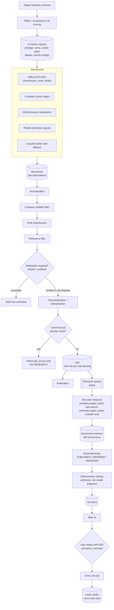

# Architecture

Status: authoritative architectural reference.
Source of record: `docs/MASTER_PLAN.md` (private). Where this document and the master plan disagree, the master plan governs.

This document is written to stand alone. A session that reads only this file should be able to understand the system's shape, its data flow, and the constraints that may not be violated.

---

## 1. What the system is

A personal recruiting-intelligence platform. It continuously watches a curated universe of high-value software-engineering employers plus public job-discovery sources, converts heterogeneous raw observations into exactly one canonical record per real opening, automatically researches relevant recruiters for genuinely new openings, infers corporate email addresses when justified by evidence, ranks recruiters deterministically, and generates outreach drafts after the user applies.

It is not a scraper and not an LLM wrapper. The engineering emphasis is heterogeneous ingestion, event-driven processing, normalization, classification, deduplication, asynchronous queues, evidence-backed research, confidence/provenance modeling, and honest observability.

---

## 2. End-to-end data flow



### The load-bearing property

A **discovery** is a raw observation from one source. A **job** is the canonical record of one real opening. Many discoveries map to one job through the `job_sources` bridge table.

Research is triggered by **the creation of a new canonical job and nothing else**. A discovery never triggers research directly. Attaching a second, third, or tenth source to an existing job triggers nothing. This is what makes the system cheap and what makes the dedup metrics meaningful.

---

## 3. Components

| Component | Technology | Responsibility |
| --- | --- | --- |
| Web app | Next.js, TypeScript, React, Tailwind, shadcn/ui | Job feed, application state, recruiter display, draft generation UI, internal `/metrics` page |
| Worker | Python 3.12+, `uv`, Pydantic, `httpx` | All pipeline stages. One codebase, three entrypoints |
| Database | Supabase PostgreSQL | Canonical state, evidence, metrics. Migrations in `supabase/migrations` |
| Queue | Supabase Queues / pgmq | Asynchronous recruiter research tasks |
| Storage | Supabase Storage (private bucket) | Resume files. Never publicly exposed |
| Auth | Supabase Auth | Single-user access control |

### Worker entrypoints

One Python package, three entrypoints. **No microservices.**

- `ingestion` — poll source configs, produce discoveries, normalize, classify, dedupe, canonicalize, enqueue research
- `research` — consume the research queue, gather evidence, discover emails, rank recruiters
- `maintenance` — archive expired untouched jobs, write daily metric snapshots, apply retention policy

---

## 4. Provider interfaces

No business logic may depend on a specific vendor or model. Every external capability sits behind an interface, and every model name lives in configuration.

| Interface | Purpose | Notes |
| --- | --- | --- |
| `LLMProvider` | The four sanctioned LLM purposes | Strict structured output, Pydantic-validated |
| `EmbeddingProvider` | Role-family similarity for classification | Prefer low-cost or local models |
| `SearchProvider` | Public web search during recruiter research | |
| `NotificationProvider` | New-qualifying-job alerts | Console in dev, email in production |
| `JobSourceAdapter` | One per source type | `fetch() -> SourceFetchResult`, preserves raw payload |

`JobSourceAdapter` implementations must each support timeouts, bounded exponential-backoff retries, structured errors, rate limiting, fixture-based tests, scan metrics, and a stable source identifier.

---

## 5. Architectural non-negotiables

These are constraints, not preferences. They may only change through an explicit user decision recorded in `docs/DECISIONS.md`.

### 5.1 Discoveries never trigger research

The full path is mandatory: discovery → normalization → company filter → role classification → verification where required → deduplication → canonical job. Only the insertion of a genuinely new canonical job may enqueue research, and it enqueues exactly one task.

**Why:** research is the expensive stage. Coupling it to raw observations would multiply cost by the number of sources that see the same job, and would make the deduplication metrics meaningless.

### 5.2 Raw titles are preserved exactly

`jobs.raw_title` holds the title exactly as published. It is never overwritten with "Software Engineer" or any other normalized display title. Classification results live in `role_family`, `role_subfamily`, `classification_confidence`, and `classification_method`.

**Why:** the published title is evidence. Normalizing it destroys the ability to audit classification, and unusual titles ("Member of Technical Staff", "Technology Summer Analyst") are precisely the interesting cases.

### 5.3 Classification optimizes for recall

The escalation order is: company-specific title mappings → universal deterministic rules → description-derived signals → embedding similarity → cheap LLM, and only for the ambiguous middle band.

Missing a strong SWE opportunity costs more than surfacing an occasional irrelevant role. Thresholds are configuration, not scattered constants. An uncalibrated score is never described as a probability.

### 5.4 LLM calls are scarce and deterministic code is preferred

**Sanctioned recurring purposes:** ambiguous role classification, recruiter research reasoning, email draft generation.
**Sanctioned offline purpose:** company scoring.

**Never permitted:** company whitelist membership during routine scans, structured ATS parsing, obvious role classification, URL normalization, strong-ID deduplication, recruiter ranking arithmetic, application state transitions, metrics.

Every model call is tracked with purpose, tokens, and estimated cost. All LLM output consumed by the application passes a strict schema and runtime validation; malformed output is rejected, never coerced.

### 5.5 LinkedIn is public-information enrichment only

Permitted: search-engine-indexed LinkedIn information, and reading public LinkedIn pages when they are anonymously accessible.

Never: authenticating, using the user's cookies or session, automating the user's account, bypassing login walls or CAPTCHA, rotating proxies to circumvent blocks, or retrying aggressively after denial.

On any denial, block, rate limit, or login wall: record the source outcome and continue the research task without LinkedIn. Authenticated LinkedIn access is permanently out of scope.

### 5.6 Reddit is a secondary signal

A Reddit claim can never directly produce a canonical job. Reddit discoveries begin `UNVERIFIED` and must be matched to an official ATS posting or company careers page before becoming eligible for canonicalization. States: `PENDING`, `VERIFIED`, `REJECTED`. Only `VERIFIED` continues.

### 5.7 Evidence and provenance

Important recruiter facts require a stored source. A fact does not exist merely because a model asserted it. Unknown information stays `UNKNOWN` — the system never fills gaps by inference presented as observation.

Email status is exactly `PUBLISHED`, `INFERRED`, or `UNKNOWN`. An inferred address is never described as guaranteed, and syntax or domain validation never promotes `INFERRED` to `PUBLISHED`. Mailbox probing is not performed.

Research completing with zero recruiters is a valid, correct result.

### 5.8 Ranking is arithmetic

An LLM never chooses recruiter ordering. Research extracts facts; code computes the score from configurable weights (discipline match 30, university/early-career match 25, candidate-level match 15, role relevance 15, email confidence 10, geographic relevance 5). A score breakdown is stored so the UI can explain any ranking.

### 5.9 The system never sends email

It generates drafts. The user reviews and sends manually. There is no code path that transmits recruiter outreach.

### 5.10 Metrics are a product feature

Every pipeline stage emits metric events from the moment it is built; instrumentation is never retrofitted. No metric is fabricated or estimated — every number must trace to stored data. Historical aggregates survive feed-retention cleanup via daily snapshots.

### 5.11 Archival over deletion

New untouched jobs are visible in the primary feed for approximately three days, then archived — not deleted. Applied, emailed, and explicitly saved jobs are retained. Historical metric aggregates are always retained. Heavy raw payloads may have their own longer retention policy.

---

## 6. Idempotency

Every stage must tolerate being run twice.

- Re-scanning a source produces no duplicate discoveries
- Re-processing discoveries produces no duplicate canonical jobs
- Duplicate queue delivery produces no duplicate recruiters and no duplicate research work
- A queue message is acknowledged only after its result is durably stored

Database uniqueness constraints — not application-layer checks alone — enforce canonical-job identity, because concurrent ingestion from multiple sources is the expected case, not an edge case.

### The permanent regression test

Three source fixtures representing the same job must always yield:

```
3 discoveries → 1 canonical job → 3 job_sources → 1 research task
```

Rerunning them must still yield 1 canonical job and no additional research task. This test is never deleted or weakened.

---

## 7. Deduplication hierarchy

Matching is attempted strongest-evidence-first:

1. **Trusted external posting identity** — ATS type + ATS job ID
2. **Canonicalized official application URL** — strip UTM/ref/tracking parameters, trailing slashes, known redirect wrappers; never strip parameters that encode job identity
3. **Deterministic fingerprint** — company ID + normalized semantic title tokens + location + recruiting season + job family
4. **Fuzzy similarity** — unresolved cases only

Merging is conservative. A missed duplicate is recoverable; a false merge destroys a real opportunity. When uncertain, do not merge.

The canonical `raw_title` is taken from the most authoritative official source among the merged discoveries.

---

## 8. Observability

Structured logs throughout, carrying correlation identifiers where available: `scan_run_id`, `discovery_id`, `job_id`, `research_task_id`, `company_id`.

Failures identify stage, provider, error class, retryability, and entity ID. Silent failure is prohibited.

**Never logged:** API keys, auth tokens, session cookies, full resume contents, private credentials.

---

## 9. Deployment target

```
Next.js frontend        → Vercel
Database/storage/queue  → Supabase
Python workers          → persistent container host
Scheduler               → production cron/scheduler
```

Nothing is deployed before the deployment phase (Phase 11), and only after explicit user approval of infrastructure configuration.

---

## 10. Related documents

| Document | Contents |
| --- | --- |
| `docs/DATA_MODEL.md` | Entities, fields, enums, relationships |
| `docs/METRICS.md` | Metric catalogue by group, with introducing phase |
| `docs/TESTING.md` | Test strategy and layers |
| `docs/DECISIONS.md` | Architecture decision records |
| `docs/PHASE_STATUS.md` | Current implementation state (private, untracked) |
| `docs/MASTER_PLAN.md` | Full specification (private, untracked) |
