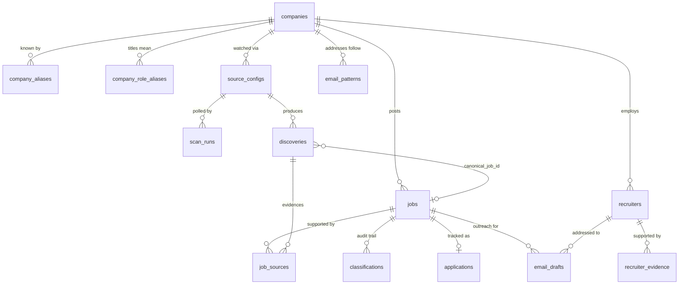

# Data Model

Status: **implemented.** The authoritative DDL is the migration set under `supabase/migrations/` (Phase 2). This document remains the readable description of intent, invariants, and vocabulary; where it and the migrations disagree, the migrations are what the database actually enforces.

Schema changes reach a database **only** through a new migration. Hand-editing is prohibited (ADR-012).

---

## 1. Entity map



The central invariant: **`discoveries` is many, `jobs` is one.** `job_sources` is the bridge that records which discoveries support which canonical job. `discoveries.canonical_job_id` is nullable — a discovery that fails filtering, classification, or verification never acquires one.

---

## 2. Company layer

### `companies`

The precomputed target registry. Scored offline; routine scans only read it.

```
id
canonical_name
domain
prestige_score
compensation_score
technical_reputation_score
selectivity_score
internship_quality_score
career_value_score
overall_score
target_company              -- the whitelist flag routine ingestion checks
score_version
scored_at
created_at
updated_at
```

`target_company` is derived from `overall_score` against a configurable threshold, but manual include/exclude overrides win. The user ultimately controls the whitelist.

### `company_aliases`

```
id
company_id
alias
```

Resolves "Meta", "Meta Platforms", and "Facebook" to one company.

### `company_role_aliases`

Company-specific title conventions. A title does not mean the same thing everywhere — "Production Engineer" and "Member of Technical Staff" are company-dependent.

```
id
company_id
title_pattern
role_family
role_subfamily
confidence
source
manually_approved           -- LLM output is never auto-promoted into a permanent rule
```

---

## 3. Ingestion layer

### `source_configs`

One row per thing being polled.

```
id
company_id                  -- nullable; community trackers span many companies
source_type
source_identifier
url
poll_interval_minutes
enabled
config_json                 -- e.g. GitHub extraction strategy, subreddit list
created_at
updated_at
```

### `scan_runs`

One row per poll attempt. The basis of all discovery and reliability metrics.

```
id
source_config_id
started_at
finished_at
status
items_seen
discoveries_created
http_requests
error_type
error_message
duration_ms
```

### `discoveries`

Every observation from every source, preserved raw. Append-mostly.

```
id
source_config_id
external_source_id
raw_company
raw_title
raw_description
raw_location
raw_compensation
raw_url
canonicalized_url
published_at
discovered_at
source_confidence
verification_status
payload_json                -- original response, subject to its own retention policy
canonical_job_id            -- nullable; set only on successful canonicalization
```

Re-observing the same posting from the same source must not create a duplicate row. Uniqueness is designed around `(source_config_id, external_source_id)` where a stable external ID exists, falling back to `canonicalized_url`.

---

## 4. Canonical layer

### `jobs`

**Exactly one row per real opening.** This table's uniqueness constraints are the system's most important correctness guarantee.

```
id
company_id
raw_title                   -- exactly as published by the most authoritative source
role_family
role_subfamily
classification_confidence
classification_method
location
compensation_min
compensation_max
compensation_currency
compensation_period
application_url
ats_type
ats_job_id
published_at                -- nullable
first_seen_at
last_seen_at
visibility_expires_at       -- drives the three-day feed policy
archived_at                 -- nullable; archival, never deletion
research_status
created_at
updated_at
```

`raw_title` is never rewritten to a normalized display title. Classification lives in the adjacent fields.

Insertion of a row here — and only that — enqueues exactly one research task.

### `job_sources`

Many discoveries support one job. This is where multi-source overlap and lead-time metrics come from.

```
id
job_id
discovery_id
source_type
source_url
external_source_id
first_seen_at
```

### `classifications`

The classification audit trail. Retained so decisions can be reviewed and the evaluation set can be built in Phase 12.

```
id
job_id / discovery_id
role_family
role_subfamily
confidence
method                      -- which stage of the escalation ladder decided
feature_summary_json        -- the signals that drove the decision
llm_model                   -- nullable
llm_tokens                  -- nullable
llm_cost                    -- nullable
manually_corrected
created_at
```

---

## 5. Recruiter layer

### `recruiters`

```
id
company_id
name
title
location
discipline
candidate_scope
profile_url
email
email_status
email_confidence
relevance_score             -- computed by code, never chosen by a model
research_status
first_found_at
last_verified_at
```

### `recruiter_evidence`

Every important recruiter fact carries provenance. A fact asserted by a model without a source is not stored as fact.

```
id
recruiter_id
source_url
source_type
fact_type
fact_value
confidence
retrieved_at
```

Facts requiring evidence: current company, current title, recruiting discipline, candidate scope, and location where relevant.

### `email_patterns`

Company-level address format evidence, used to justify `INFERRED` emails.

```
id
company_id
pattern                     -- e.g. first.last@company.com
example_count
independent_source_count
confidence
last_updated_at
```

Confidence must reflect both how many examples were seen and how many independent sources they came from.

---

## 6. Application layer

### `applications`

```
id
job_id
status
applied_at                  -- nullable
emailed_at                  -- nullable
ignored_at                  -- nullable
created_at
updated_at
```

### `email_drafts`

```
id
job_id
recruiter_id
resume_version
subject
body
model
prompt_version
input_tokens
output_tokens
estimated_cost
created_at
```

Drafts are generated on demand and stored. Nothing in the schema records a "sent" state, because the system does not send.

---

## 7. Metrics layer

### `metric_events`

Generic, append-only instrumentation. Written through the semantic metrics API, never by ad-hoc SQL from business logic.

```
id
event_name
entity_type
entity_id
numeric_value               -- nullable
metadata_json
occurred_at
```

### `daily_metric_snapshots`

Preserves historical aggregates so resume-grade metrics survive raw-payload purging and feed retention cleanup. Once a day is snapshotted, that row is never recomputed from data that may since have been pruned.

### `application_outcomes` (optional, post-MVP)

Manual tracking only, never required:

```
recruiter_reply
online_assessment
interview
offer
rejection
```

Causal attribution is not implied by these being stored alongside outreach data.

---

## 8. Enum vocabularies

These strings are fixed. Adding a value is a decision-record-worthy change.

### `email_status`

```
PUBLISHED       -- the address itself appears in a trustworthy public source
INFERRED        -- derived from an evidenced company pattern; never "guaranteed"
UNKNOWN         -- evidence is insufficient; the correct answer when in doubt
```

### Application status

```
NOT_APPLIED
APPLIED_NOT_EMAILED
APPLIED_EMAILED
IGNORED
```

### Discovery `verification_status`

```
PENDING
VERIFIED
REJECTED
```

Reddit and other unofficial discoveries begin unverified and require a match to an official ATS posting or careers page before canonicalization eligibility.

### Recruiter `candidate_scope`

```
UNDERGRADUATE
UNIVERSITY
INTERN
NEW_GRAD
MASTERS
MBA
EXPERIENCED
UNKNOWN
```

Class-year specificity is never invented; absent explicit support, the value is `UNKNOWN`.

### `role_family`

```
SOFTWARE_ENGINEERING
ML_ENGINEERING
DATA_ENGINEERING
QUANT_DEVELOPMENT
DATA_SCIENCE
SECURITY_ENGINEERING
SRE_INFRASTRUCTURE
HARDWARE
ELECTRICAL_ENGINEERING
MECHANICAL_ENGINEERING
PRODUCT
IT
OTHER
```

Which families are *targeted* is configuration, separate from which family a job *is*.

---

## 9. Constraint design principles

Applied in the Phase 2 migrations:

- Uniqueness is designed for **idempotent ingestion first**, cosmetics second
- Canonical job identity is enforced in the database, not only in application code, because concurrent multi-source ingestion is the normal case
- Enum values use native Postgres enums so invalid states are rejected at write time (ADR-016)
- Foreign keys are real; orphaned evidence is a bug
- Every table carries timestamps, maintained by a shared `set_updated_at` trigger
- Deletion is avoided in favor of archival flags wherever history has analytical value

### Uniqueness rules as built

| Table | Rule | Purpose |
| --- | --- | --- |
| `discoveries` | `(source_config_id, external_source_id)` where the ID exists | Re-scanning does not duplicate |
| `discoveries` | `(source_config_id, canonicalized_url)` where no ID exists | Fallback identity |
| `discoveries` | CHECK: an ID **or** a URL must be present | Without one, idempotency is impossible |
| `jobs` | `(ats_type, ats_job_id)` where both present | **Dedupe Level 1** |
| `jobs` | `application_url` where present | **Dedupe Level 2** |
| `job_sources` | `(job_id, discovery_id)` | A source attaches once |
| `job_sources` | `discovery_id` | One discovery supports at most one job |
| `company_aliases` | `lower(alias)` globally | An alias resolves to exactly one company |
| `applications` | `job_id` | One application record per job |
| `daily_metric_snapshots` | `(snapshot_date, metric_name)` | Snapshots are idempotent per day |

Dedupe Levels 3 and 4 are deliberately absent; they depend on normalization rules that arrive in Phase 6 (ADR-017).

### Invariants enforced by check constraint

- `jobs.raw_title` cannot be blank — the published title is evidence
- An ATS identity is all-or-nothing, so a half-populated one cannot pose as a dedupe key
- `recruiters`: `UNKNOWN` forbids an address; any other status requires one
- `applications`: status and timestamps must agree (`APPLIED_EMAILED` without `emailed_at` is unwritable)
- `classifications`: only `LLM_FALLBACK` may carry token or cost figures
- `email_patterns`: independent sources cannot exceed examples
- `scan_runs`: a `RUNNING` scan has no finish time; a finished one must have one
- `metric_events`: **append-only**, enforced by a trigger that rejects UPDATE and DELETE

## 10. Security

Row level security is enabled on all sixteen tables with no policies, denying access to unprivileged roles by default. The worker connects with the service role and bypasses it. UI policies arrive in Phase 9 (ADR-015).
